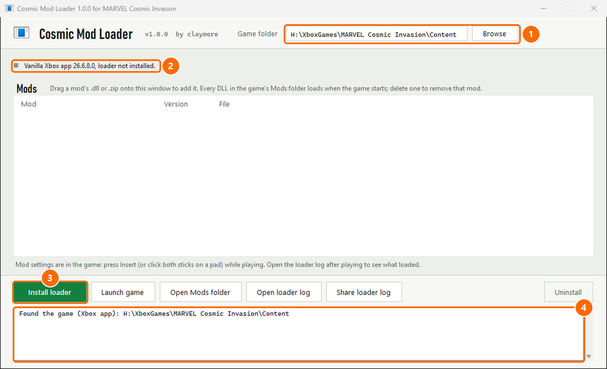
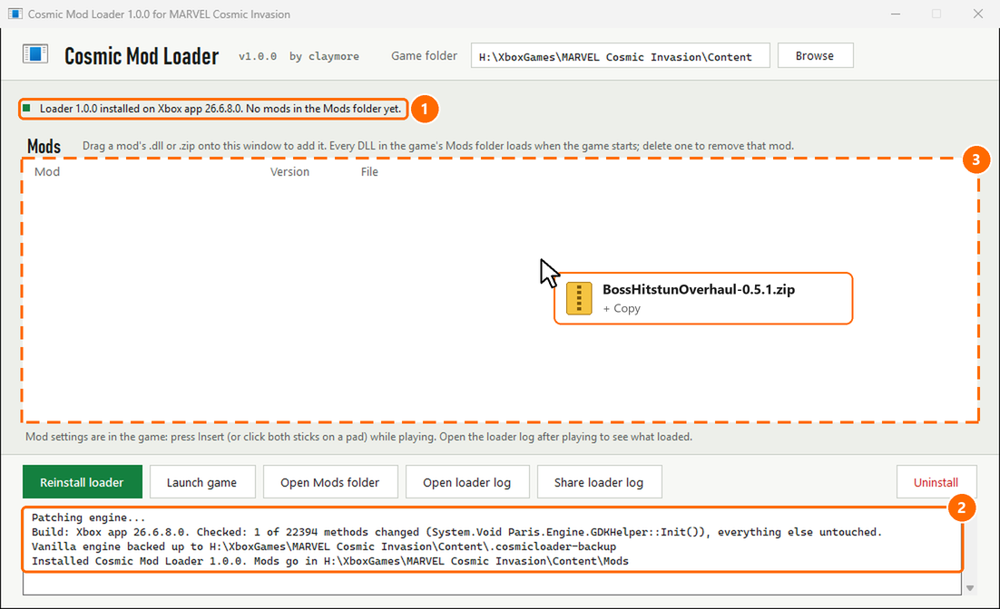
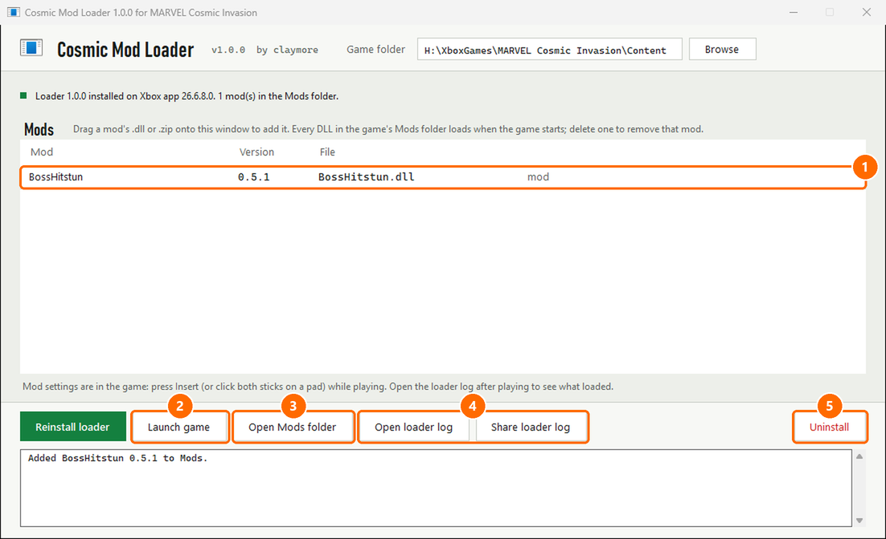
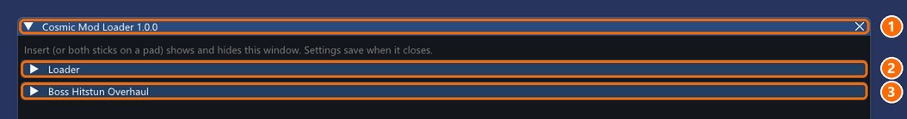
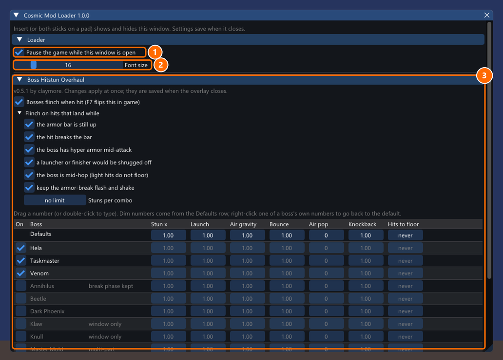
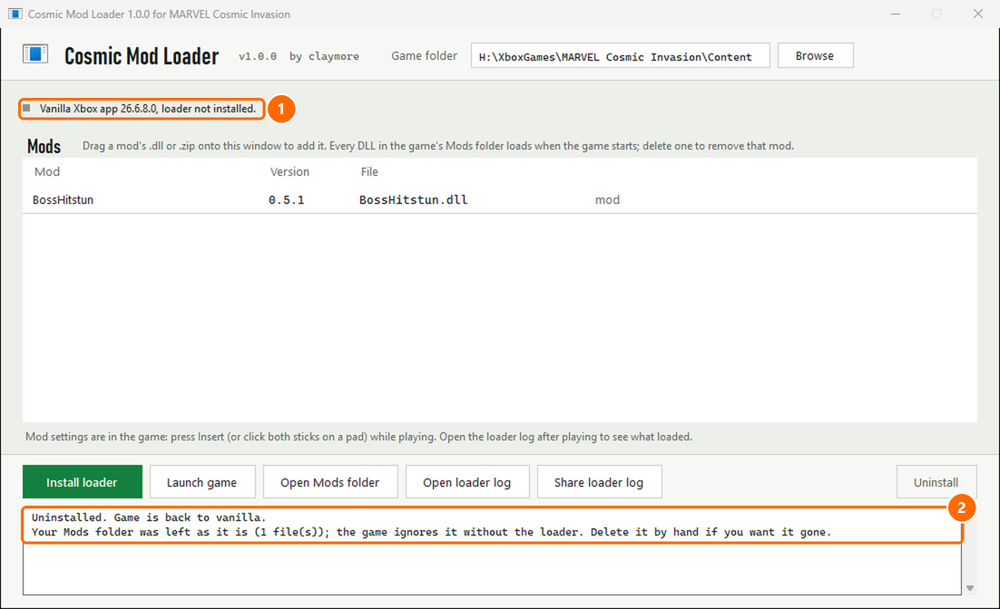

# Cosmic Mod Loader

Mod loader for MARVEL Cosmic Invasion. Works on the Xbox app (Game Pass) and Steam.

Install it once. After that, adding a mod is dragging a file onto a window.
Mod settings open in game with **Insert**.

**[Download the latest version](https://github.com/ren-/CosmicModLoader/releases/latest)**

Mods to try: [Boss Hitstun Overhaul](https://www.nexusmods.com/marvelcosmicinvasion/mods/19)

Made by claymore.

## Quick install

1. Download the zip and extract **all** of it into one folder.
2. Close the game.
3. Run `CosmicModLoader.exe`.
4. Click **Install loader**.
5. Drag your mod's zip onto the window.
6. Play. Press **Insert** in game for mod settings.

Same steps with pictures below.

## 1. Open the app

1. Your game folder, found automatically. Wrong one? Click **Browse** and pick the folder with `Game.exe` in it.
2. Grey dot: loader not installed yet.
3. Click **Install loader**.
4. What the app is doing.

> Windows says "Windows protected your PC"? Click **More info**, then **Run anyway**. The app just isn't signed.

## 2. Install

1. Green dot: loader installed.
2. The original game file is backed up, then patched.
3. Drop mods here.

## 3. Add mods

Drag a mod's `.zip` or `.dll` onto the window. Dropping a mod you already have replaces it.

1. Your mod. Red text here means it can't load, and says why.
2. **Launch game**
3. **Open Mods folder**
4. **Open loader log** and **Share loader log** (copies it for bug reports)
5. **Uninstall**

## 4. Mod settings in game

Press **Insert**, or click **both sticks** on a pad. Press again to close.

1. Drag the title bar to move it. **X** closes it.
2. Loader options.
3. Your mods. Click one to open it.

1. Pause the game while this is open (single player only).
2. **Font size.** Turn it up on a 4K screen.
3. The mod's settings. Changes apply right away and save when you close the window.

The game ignores your controls while the window is open.

*These two pictures come from a preview tool. In game the window sits on top of the game.*

## 5. Remove a mod or everything

- **One mod:** click **Open Mods folder** and delete its file.
- **Everything:** close the game and click **Uninstall**.

1. The game is back to vanilla.
2. Your Mods folder stays, so reinstalling brings your mods back.

## Game updated and mods stopped working?

That's expected. A game update switches the loader off and the game runs vanilla.
Wait for a loader update, run the new version and click **Install loader** again.
Your mods and their settings stay.

## Problems

| Problem | Fix |
|---|---|
| Game won't start after installing | Your antivirus probably removed `CosmicLoader.dll`. Restore it, or click **Uninstall**. |
| Antivirus or SmartScreen flags the app | New unsigned apps get flagged. Nothing in it is packed or hidden, and you can open it in dnSpy to check. |
| "GAME IS RUNNING, close it first" | Fully close the game, then click back into the app. |
| App can't find the game | Click **Browse**. Xbox: pick the `Content` folder. Steam: pick the game folder. |
| "...is already in the game folder but I didn't put it there" | Delete the file it names and install again. |
| **Insert** does nothing | Click the game window once. Still nothing? Open the loader log and look for `Overlay ready`. |
| A mod does nothing | The loader log lists every mod it started, and why any failed. |

The loader log is at `%LOCALAPPDATA%\CosmicLoader\loader.log`, or click **Open loader log**.

## Found a bug?

[Open an issue](https://github.com/ren-/CosmicModLoader/issues). Include:

- Xbox app or Steam
- what happened
- the loader log (**Share loader log** grabs this session's and the last one's)

## Make your own mod

Start from the [mod template](template/): a working example mod plus steps.

## More details

Supported game versions

| Version | Game folder |
|---|---|
| Xbox app 26.6.8.0 | `C:\XboxGames\MARVEL Cosmic Invasion\Content` |
| Steam, July 2026 (1.0.0.13466) | `...\steamapps\common\MARVEL Cosmic Invasion` |

The app checks the game version before changing anything. It won't touch a version it doesn't know.

What it changes in your game folder

- Backs up `ParisEngine.dll` to `.cosmicloader-backup\`, then adds one line to it that starts the loader. Nothing else in the file changes, and the app checks that.
- Adds `CosmicLoader.dll`, `0Harmony.dll`, a `CosmicLoader\` folder for the overlay and an empty `Mods` folder.
- Never touches `Game.exe` or your saves.
- Nothing is downloaded. It patches your own copy of the game, on your PC, and never goes online.
- **Uninstall** puts the original file back exactly. Verifying game files in the Xbox app or Steam does too.

What's in the zip

| File | What it is |
|---|---|
| `CosmicModLoader.exe` | the app |
| `CosmicLoader.dll` | the loader, copied into the game folder |
| `0Harmony.dll` | [Harmony](https://github.com/pardeike/Harmony), used by mods (MIT) |
| `Mono.Cecil.dll` | [Mono.Cecil](https://github.com/jbevain/cecil), used by the app to patch the game (MIT) |
| `lib\` | the overlay: [Dear ImGui](https://github.com/ocornut/imgui) and [ImGui.NET](https://github.com/ImGuiNET/ImGui.NET) (MIT) |
| `*-LICENSE.txt` | licences |

Logs

- `%LOCALAPPDATA%\CosmicLoader\loader.log`: which DLLs it found, which mods started, why any failed.
- `loader.old.log` next to it is the session before.
- Mods keep their own logs.

Free to download and use. Third-party libraries in the zip are MIT, licence texts included.
